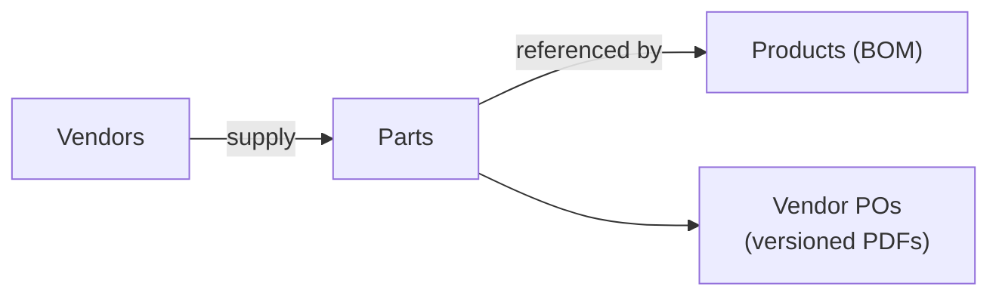
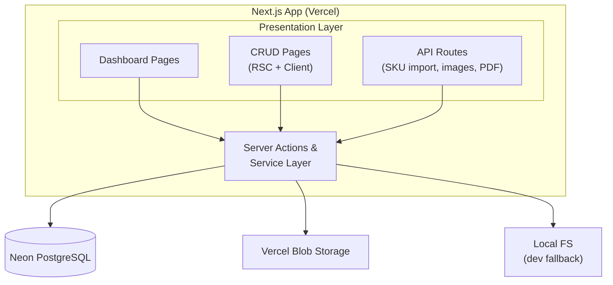
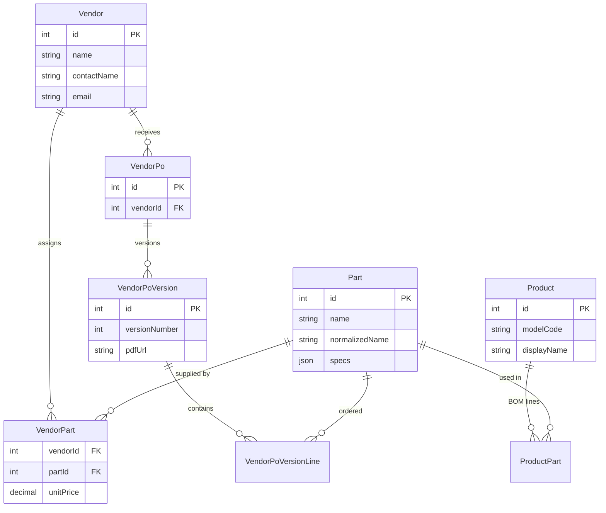
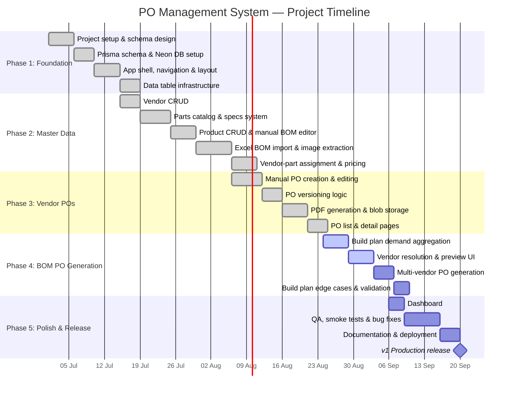

# Statement of Work (SOW)

## Vendor Purchase Order Management System

| Field | Detail |
|-------|--------|
| **Project** | PO Management (`po-mgmt`) |
| **Version** | 1.0 |
| **Date** | 1 July 2026 |
| **Status** | In development |

---

## 1. Executive Summary

This project delivers a web-based **Vendor Purchase Order Management System** for manufacturing operations. The system centralizes master data for vendors, parts, and products (with Bills of Materials), and enables procurement teams to create, version, and export vendor purchase orders as PDFs.

The platform supports two procurement workflows:

1. **Manual PO creation** — select a vendor, add part lines with quantities, and generate a versioned PDF.
2. **BOM-driven PO generation** — define a build plan (products × build quantities), aggregate part demand across BOMs, resolve vendor assignments and pricing, and generate one PO per vendor.

---

## 2. Business Requirements and Needs

### 2.1 Business Context

Manufacturing teams currently manage product BOMs in spreadsheets and create vendor purchase orders manually. This leads to:

- **Data fragmentation** — vendor, part, and product information lives in disconnected Excel files.
- **Manual PO assembly** — procurement staff must manually calculate quantities when building multiple products.
- **No audit trail** — changes to purchase orders are not versioned or easily traceable.
- **Inconsistent part catalog** — duplicate or inconsistently named parts across product lines.

The system addresses these needs by providing a single source of truth for master data, automated demand aggregation from BOMs, vendor-scoped part pricing, and immutable versioned PO PDFs.

### 2.2 Business Objectives

| # | Objective | Success Metric |
|---|-----------|----------------|
| BO-1 | Centralize vendor, part, and product master data | All catalog data manageable in one application |
| BO-2 | Reduce time to create vendor POs | PO creation in minutes vs. manual spreadsheet work |
| BO-3 | Enable bulk PO generation from production build plans | One action produces POs grouped by vendor |
| BO-4 | Maintain PO change history | Every material change creates a new downloadable PDF version |
| BO-5 | Support bulk catalog onboarding | Excel BOM import creates products, parts, and BOM lines in one step |

### 2.3 Stakeholders

| Role | Responsibility |
|------|----------------|
| **Procurement / Purchasing** | Create and edit vendor POs, assign parts to vendors, set unit prices |
| **Product / Engineering** | Maintain product BOMs, import SKU spreadsheets, manage part specifications |
| **Operations / Production Planning** | Define build plans and trigger BOM-driven PO generation |
| **Management** | Review dashboard metrics and recent PO activity |

### 2.4 Scope

**In scope**

- Vendor, part, and product CRUD
- Structured part specifications by category (LED driver, PCB, fastener, etc.)
- Excel BOM import with embedded image extraction
- Manual product BOM editing
- Vendor–part assignment with per-vendor unit pricing
- Manual vendor PO creation and editing
- BOM-driven build plan PO generation with vendor resolution
- PO versioning with PDF export per version
- Dashboard with entity counts and recent PO activity
- Image storage for parts, products, and BOM line images

**Out of scope (v1)**

- User authentication and role-based access control
- Inventory / stock tracking and goods receipt
- Multi-currency support beyond a single configured currency
- Email delivery of POs to vendors
- Approval workflows for PO issuance
- Integration with ERP or accounting systems
- Purchase order delivery status / fulfillment tracking

### 2.5 User Stories and Use Cases

#### Epic 1: Master Data Management

| ID | User Story | Acceptance Criteria |
|----|------------|---------------------|
| US-1.1 | As a procurement user, I want to create and manage vendor records so that supplier contact information is centralized. | User can create, view, edit, and delete vendors with name, contact, email, phone, and address. |
| US-1.2 | As an engineering user, I want to maintain a parts catalog with structured specifications so that parts are consistently described across products. | User can create parts with name, category, JSON specs, description, and images. Spec fields vary by category (e.g. LED driver: input/output voltage, power). |
| US-1.3 | As an engineering user, I want to create products with model codes and display names so that finished goods are identifiable. | User can create products with unique model codes, display names, and product images. |
| US-1.4 | As an engineering user, I want to import product BOMs from Excel so that I can onboard catalog data in bulk. | Uploading a `.xlsx` file creates/updates a product, upserts parts, replaces BOM lines, and extracts embedded images. |
| US-1.5 | As an engineering user, I want to manually edit a product BOM so that I can adjust lines without re-importing. | User can add, edit, and remove BOM lines on the product detail page by selecting existing parts. |

**Use Case UC-1: Excel BOM Import**

| Field | Description |
|-------|-------------|
| **Actor** | Engineering / Product user |
| **Preconditions** | User has a valid product BOM spreadsheet (`.xlsx`) |
| **Main flow** | 1. User uploads file from Products page or product detail page. 2. System parses display name (B2), model code (B3), and BOM rows (row 6+). 3. System upserts parts with normalized names and parsed specs. 4. System replaces product BOM and stores extracted images. 5. User sees import summary with any skipped rows. |
| **Alternate flow** | Duplicate part names within the same file are rejected with a clear error. |
| **Postconditions** | Product, parts, and BOM are persisted; images stored in blob storage. |

#### Epic 2: Vendor–Part Relationships

| ID | User Story | Acceptance Criteria |
|----|------------|---------------------|
| US-2.1 | As a procurement user, I want to assign parts to a vendor so that PO line pickers are scoped to that vendor's catalog. | On vendor detail page, user can assign/unassign parts and set unit price per assignment. |
| US-2.2 | As a procurement user, I want unit prices stored per vendor–part pair so that PO totals are calculated automatically. | Unit price is optional on assignment; PO creation requires a price for every line. |

**Use Case UC-2: Assign Part to Vendor**

| Field | Description |
|-------|-------------|
| **Actor** | Procurement user |
| **Preconditions** | Vendor and part exist in the system |
| **Main flow** | 1. User opens vendor detail page. 2. User searches available parts and assigns one with optional unit price. 3. Part appears in vendor's assigned parts table. |
| **Postconditions** | `VendorPart` record created; part available in PO creation for that vendor. |

#### Epic 3: Vendor Purchase Orders (Manual)

| ID | User Story | Acceptance Criteria |
|----|------------|---------------------|
| US-3.1 | As a procurement user, I want to create a vendor PO by selecting parts and quantities so that I can order from a specific supplier. | User picks vendor, adds lines (part + quantity), saves. Version 1 is created with PDF. |
| US-3.2 | As a procurement user, I want to edit an existing PO so that I can adjust quantities or add/remove lines. | Saving material changes creates a new version; unchanged saves do not create a new version. |
| US-3.3 | As a procurement user, I want to download a PDF for any PO version so that I can send it to the vendor. | Each version has a downloadable PDF with vendor details, line items, quantities, unit prices, and totals. |
| US-3.4 | As a procurement user, I want PO line pickers scoped to the vendor's assigned parts so that I only see relevant parts. | Part selector on PO editor shows only parts assigned to the selected vendor. |

**Use Case UC-3: Create and Version a Vendor PO**

| Field | Description |
|-------|-------------|
| **Actor** | Procurement user |
| **Preconditions** | Vendor exists with assigned parts (priced) |
| **Main flow** | 1. User creates PO for vendor, adds part lines with quantities. 2. System validates all parts are assigned to vendor with prices. 3. System creates PO, version 1, generates PDF, stores PDF URL. 4. User later edits lines and saves. 5. System detects change, creates version 2 with new PDF. |
| **Postconditions** | PO has version history; each version PDF is retained and downloadable. |

#### Epic 4: BOM-Driven PO Generation

| ID | User Story | Acceptance Criteria |
|----|------------|---------------------|
| US-4.1 | As a production planner, I want to define a build plan (products × quantities) so that part demand is calculated automatically. | User adds one or more product rows with build quantities in the Generate from BOM dialog. |
| US-4.2 | As a production planner, I want to preview aggregated part demand before generating POs so that I can resolve issues. | Preview shows per-part totals, demand sources, vendor options, and status (resolved / unassigned / ambiguous / unpriced). |
| US-4.3 | As a production planner, I want ambiguous vendor assignments resolved manually so that parts with multiple suppliers are handled correctly. | User can override vendor selection for parts with multiple assigned vendors. |
| US-4.4 | As a production planner, I want POs grouped by vendor so that one PO is created per supplier. | Generating from build plan creates one PO per vendor with aggregated lines. |

**Use Case UC-4: Generate POs from Build Plan**

| Field | Description |
|-------|-------------|
| **Actor** | Production planner / Procurement user |
| **Preconditions** | Products have BOM lines; parts assigned to vendors with prices |
| **Main flow** | 1. User opens "Generate from BOM" on Vendor POs page. 2. User adds products and build quantities. 3. User previews demand; resolves ambiguous/unpriced/unassigned parts. 4. User confirms generation. 5. System creates one PO per vendor, each with version 1 and PDF. 6. User is redirected to vendor PO list. |
| **Alternate flow** | Products with empty BOMs or unresolved parts block generation with actionable error messages. |
| **Postconditions** | One or more vendor POs created with correct aggregated quantities. |

#### Epic 5: Dashboard and Reporting

| ID | User Story | Acceptance Criteria |
|----|------------|---------------------|
| US-5.1 | As a manager, I want a dashboard overview so that I can see catalog and PO activity at a glance. | Dashboard shows counts for vendors, parts, products, and POs, plus a table of the 5 most recent POs. |

---

## 3. Technical Requirements and Needs

### 3.1 Technology Stack

| Layer | Technology |
|-------|------------|
| **Framework** | Next.js 16 (App Router) |
| **Language** | TypeScript 5 |
| **UI** | React 19, shadcn/ui, Tailwind CSS 4 |
| **Data tables** | TanStack React Table |
| **Database** | PostgreSQL (Neon serverless) |
| **ORM** | Prisma 7 |
| **File storage** | Vercel Blob (PDFs, catalog images, BOM images) |
| **PDF generation** | @react-pdf/renderer |
| **Excel parsing** | SheetJS (`xlsx`) |
| **Runtime / package manager** | Bun |
| **Linting / formatting** | Biome |
| **Deployment target** | Vercel |

### 3.2 System Architecture

### 3.3 Data Model

| Entity | Key Fields | Relationships |
|--------|------------|---------------|
| **Vendor** | name, contact, email, phone, address | → VendorPart, VendorPo |
| **Part** | name, normalizedName, category, specs (JSON), imageUrls, description | → ProductPart, VendorPart, VendorPoVersionLine |
| **Product** | modelCode, displayName, imageUrls | → ProductPart (BOM) |
| **ProductPart** | itemNo, quantity, remarks, BOM images | Product ↔ Part |
| **VendorPart** | unitPrice | Vendor ↔ Part (unique pair) |
| **VendorPo** | vendorId | → VendorPoVersion[] |
| **VendorPoVersion** | versionNumber, pdfUrl | → VendorPoVersionLine[] |
| **VendorPoVersionLine** | quantity, unitPrice (snapshot) | Part reference |

### 3.4 Functional Requirements

#### FR-1: Vendor Management

| ID | Requirement |
|----|-------------|
| FR-1.1 | System shall provide paginated, searchable list of vendors. |
| FR-1.2 | System shall support create, read, update, and delete for vendor records. |
| FR-1.3 | Vendor detail page shall display assigned parts with unit prices and support assign/remove/update price. |

#### FR-2: Parts Catalog

| ID | Requirement |
|----|-------------|
| FR-2.1 | System shall maintain a parts catalog with unique normalized names. |
| FR-2.2 | Parts shall support category-based structured specifications (JSON). |
| FR-2.3 | System shall parse free-text descriptions from Excel imports into structured specs. |
| FR-2.4 | Parts shall support multiple catalog images. |
| FR-2.5 | System shall provide paginated, searchable parts list with spec-aware search. |

#### FR-3: Products and BOMs

| ID | Requirement |
|----|-------------|
| FR-3.1 | Products shall have unique model codes and display names. |
| FR-3.2 | System shall import BOM data from Excel (`.xlsx`) with defined cell layout. |
| FR-3.3 | Excel import shall extract embedded cell images (side, front, bottom) to blob storage. |
| FR-3.4 | Product detail page shall support manual BOM line add, edit, and remove. |
| FR-3.5 | BOM lines shall reference existing parts by selection. |

#### FR-4: Vendor Purchase Orders

| ID | Requirement |
|----|-------------|
| FR-4.1 | System shall create vendor POs with at least one line item. |
| FR-4.2 | PO lines shall only include parts assigned to the selected vendor. |
| FR-4.3 | All PO lines shall require a positive integer quantity and a vendor-assigned unit price. |
| FR-4.4 | Saving PO changes that alter lines shall create a new immutable version. |
| FR-4.5 | Saving without line changes shall not create a new version. |
| FR-4.6 | Each version shall generate and store a PDF document. |
| FR-4.7 | PDF shall include company name, vendor details, line items (name, description, qty, unit price, line total), and grand total. |
| FR-4.8 | PO detail page shall list all versions with download links. |

#### FR-5: BOM-Driven PO Generation

| ID | Requirement |
|----|-------------|
| FR-5.1 | System shall accept a build plan of product ID + build quantity pairs. |
| FR-5.2 | System shall aggregate part demand as `BOM quantity × build quantity` across all products. |
| FR-5.3 | System shall resolve vendor per part: single vendor auto-selected; multiple vendors flagged as ambiguous. |
| FR-5.4 | System shall flag parts with no vendor assignment or missing unit price. |
| FR-5.5 | User shall be able to override vendor selection for ambiguous parts before generation. |
| FR-5.6 | Generation shall create one PO per vendor with deduplicated part lines and summed quantities. |
| FR-5.7 | Generation shall be blocked until all parts are resolved and priced. |

#### FR-6: Dashboard

| ID | Requirement |
|----|-------------|
| FR-6.1 | Dashboard shall display entity counts (vendors, parts, products, vendor POs). |
| FR-6.2 | Dashboard shall list the 5 most recently created vendor POs with version and line count. |

#### FR-7: File and Image Handling

| ID | Requirement |
|----|-------------|
| FR-7.1 | System shall store PDFs, catalog images, and BOM images in Vercel Blob when configured. |
| FR-7.2 | System shall fall back to local filesystem storage in development when blob token is absent. |
| FR-7.3 | SKU Excel uploads shall be staged via API route with size limits. |

### 3.5 Non-Functional Requirements

#### NFR-1: Performance

| ID | Requirement | Target |
|----|-------------|--------|
| NFR-1.1 | Page load time for list views | < 2 seconds on standard broadband |
| NFR-1.2 | Excel BOM import (single file, ~100 rows) | < 30 seconds including image extraction |
| NFR-1.3 | PDF generation per PO version | < 10 seconds |
| NFR-1.4 | Build plan preview | < 5 seconds for up to 10 products |

#### NFR-2: Reliability and Data Integrity

| ID | Requirement |
|----|-------------|
| NFR-2.1 | PO version snapshots shall store unit prices at time of creation (not live vendor prices). |
| NFR-2.2 | Database shall enforce referential integrity via foreign keys and cascade rules. |
| NFR-2.3 | Part names shall be normalized to prevent duplicate catalog entries. |
| NFR-2.4 | PO line validation shall reject duplicate parts on the same PO. |

#### NFR-3: Usability

| ID | Requirement |
|----|-------------|
| NFR-3.1 | UI shall be responsive and usable on desktop and tablet viewports. |
| NFR-3.2 | System shall provide toast notifications for success and error feedback. |
| NFR-3.3 | Destructive actions (delete) shall require confirmation. |
| NFR-3.4 | Build plan preview shall clearly indicate unresolved parts with actionable status badges. |
| NFR-3.5 | Application shall support light and dark themes. |

#### NFR-4: Security

| ID | Requirement |
|----|-------------|
| NFR-4.1 | Database credentials and blob tokens shall be stored in environment variables, not source code. |
| NFR-4.2 | File upload endpoints shall enforce size and type restrictions. |
| NFR-4.3 | Authentication and authorization are deferred to a future phase; v1 assumes trusted internal network access. |

#### NFR-5: Maintainability

| ID | Requirement |
|----|-------------|
| NFR-5.1 | Codebase shall use TypeScript with strict type checking. |
| NFR-5.2 | Business logic shall reside in service layer modules, separate from UI components. |
| NFR-5.3 | Database schema changes shall be managed via Prisma migrations. |
| NFR-5.4 | Linting and formatting shall be enforced via Biome. |

#### NFR-6: Deployability

| ID | Requirement |
|----|-------------|
| NFR-6.1 | Application shall build and deploy on Vercel without custom infrastructure. |
| NFR-6.2 | Database shall use Neon serverless PostgreSQL with connection pooling. |
| NFR-6.3 | `bun run lint && bun run typecheck && bun run build` shall pass before deployment. |

#### NFR-7: Observability

| ID | Requirement |
|----|-------------|
| NFR-7.1 | Smoke test script (`bun run smoke:vendor-po`) shall validate PO create, version, and PDF flow. |
| NFR-7.2 | Import operations shall return structured summaries (created, updated, skipped rows). |

### 3.6 Environment and Configuration

| Variable | Required | Purpose |
|----------|----------|---------|
| `DATABASE_URL` | Yes | Neon PostgreSQL connection string |
| `BLOB_READ_WRITE_TOKEN` | No (prod: yes) | Vercel Blob for PDFs and images |

### 3.7 API and Integration Points

| Endpoint / Action | Method | Purpose |
|-------------------|--------|---------|
| `/api/sku-import/upload` | POST | Stage Excel file for import |
| `/api/sku-import/stage` | POST | Process staged Excel import |
| `/api/catalog-images/upload` | POST | Upload catalog images |
| `/api/catalog-images/[...path]` | GET | Serve catalog images |
| `/api/bom-images/[...path]` | GET | Serve BOM line images |
| `/api/pdf/[versionId]` | GET | Download PO version PDF |
| Server Actions (`lib/actions/*`) | — | CRUD and business operations from UI |

---

## 4. Project Timeline (Gantt Chart)

The timeline below reflects phased delivery from project kickoff through v1 production release. Dates assume a start of **1 July 2026**.

### Phase Summary

| Phase | Duration | Deliverables | Target |
|-------|----------|--------------|--------|
| **Phase 1: Foundation** | ~3 weeks | DB schema, app shell, shared UI components, data tables | 19 Jul 2026 |
| **Phase 2: Master Data** | ~4 weeks | Vendors, parts, products, Excel import, vendor-part pricing | 16 Aug 2026 |
| **Phase 3: Vendor POs** | ~2.5 weeks | Manual PO CRUD, versioning, PDF export | 6 Sep 2026 |
| **Phase 4: BOM PO Generation** | ~2 weeks | Build plan UI, demand preview, multi-vendor PO creation | 13 Sep 2026 |
| **Phase 5: Polish & Release** | ~2 weeks | Dashboard, QA, docs, production deployment | 20 Sep 2026 |

---

## 5. Deliverables

| # | Deliverable | Description |
|---|-------------|-------------|
| D-1 | Web application | Deployed Next.js app on Vercel |
| D-2 | Database | Neon PostgreSQL with Prisma migrations |
| D-3 | Source code | TypeScript codebase in `po-mgmt` repository |
| D-4 | Documentation | README (setup, flows), this SOW |
| D-5 | Operational scripts | SKU import CLI, smoke test, backfill utilities |

---

## 6. Assumptions and Dependencies

| # | Assumption / Dependency |
|---|-------------------------|
| A-1 | Users have access to standard product BOM Excel templates with the defined cell layout. |
| A-2 | Neon PostgreSQL and Vercel accounts are provisioned for deployment. |
| A-3 | Vercel Blob storage is configured for production PDF and image persistence. |
| A-4 | v1 operates on a trusted internal network without authentication. |
| A-5 | Single currency (configured in money service) is sufficient for v1. |
| A-6 | Product BOMs are reference data; inventory and fulfillment are out of scope. |

---

## 7. Acceptance Criteria (v1 Release)

The project is accepted when:

1. All functional requirements (FR-1 through FR-7) are implemented and verified.
2. `bun run lint && bun run typecheck && bun run build` passes without errors.
3. `bun run smoke:vendor-po` completes successfully against a test database.
4. Excel BOM import successfully processes a representative product file.
5. Build plan PO generation creates correct POs grouped by vendor with accurate quantities.
6. PO PDFs are generated, stored, and downloadable for every version.
7. Application is deployed to Vercel with production database and blob storage configured.

---

## 8. Future Enhancements (Post-v1)

| Priority | Enhancement |
|----------|-------------|
| High | User authentication and role-based access (procurement vs. engineering) |
| High | Email PO PDFs directly to vendor contacts |
| Medium | PO approval workflow before issuance |
| Medium | Multi-currency support |
| Medium | ERP / accounting system integration |
| Low | Inventory tracking and goods receipt against POs |
| Low | PO delivery status and fulfillment tracking |

---

*Document generated from the `po-mgmt` codebase and project requirements. Last updated: 1 July 2026.*
